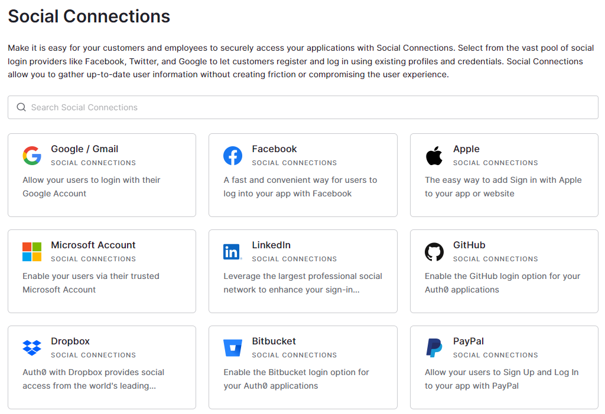

# APP POC

Demo of application -> https://web-production-5bdf3.up.railway.app/

The concept of the app I will split into three separate sections:
1. Base application 
2. E-mail whitelist
3. User Count 

A Boilerplate for the base application can be easily created by Auth0 app generation. For the POC purpose, I will be using 
regular web application, but Auth0 offers a template for Native, Single page applications and Machine to machine apps.

Auth0 dashboard offers an extensive view of several important information, but at this moment, the most crucial right now is the Settings view 
and Connections. 

In settings under Basic Information, there is Domain/Client ID and Client Secret. These will be set as the environmental variable for the app, which will allow the app to connect with Auth0.
Another critical section in this view is Application URIs, where you will set URLs for callback and log out according to your hosting.

To allow users to log in via Google and Facebook, you need to open the Connections subpage and turn on the switch for both connections. 
If you need more connections, Marketplace offers other solutions like Apple/GitHub etc. 





## Actions and Flows
For E-mail whitelist and User count I will use Auth0 Action Flows, Login to be precise. 


## E-mail whitelist

First code is example of how you can handle email whitelist. For POC purpose it's small SET that will only allow emails from the hard-coded list of addresses.
If your company has custom email ending, this code can be easliy changed to allow auth from the set of emails based on rule.

```javascript
exports.onExecutePostLogin = async (event, api) => {
const whitelistEmailsSet = new Set(['sample@example.com'])

  if (event.user.email && whitelistEmailsSet.has(event.user.email)) {
}
  else {
  api.access.deny(`Access to ${event.client.name} is not allowed.`);
};
}
```

## User Count
For user count, I'm using user metadata to store count and claims to serve number in the callback. Both claims and user metadata are offer as a built-in functions to Auth0.

```javascript
exports.onExecutePostLogin = async (event, api) => {
  if (!event.user.user_metadata.userCount){
    api.user.setUserMetadata("userCount", 1)
  }
  else{
    api.user.setUserMetadata("userCount",event.user.user_metadata.userCount+1 )
  }

  const userCount = event.user.user_metadata.userCount;
  if (event.authorization) {
    // Set claims 
    api.idToken.setCustomClaim(`userCount`, userCount);
  }

};
```

More details about Actions and Flows can be found here -> https://auth0.com/docs/customize/actions/actions-overview

